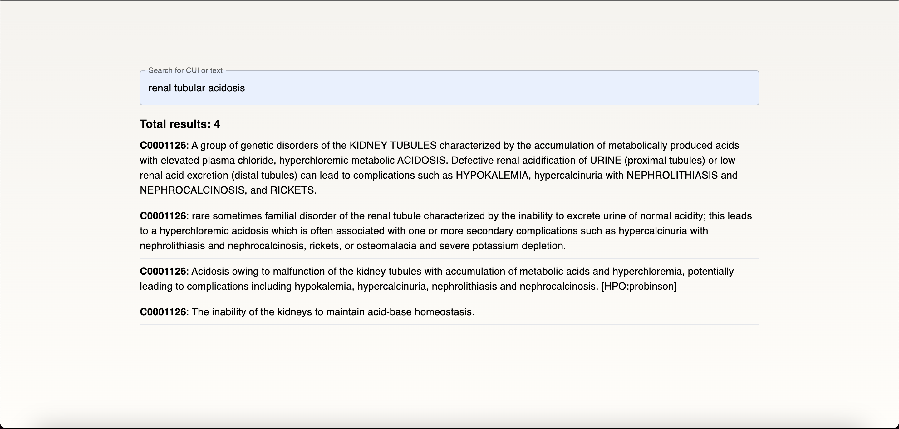
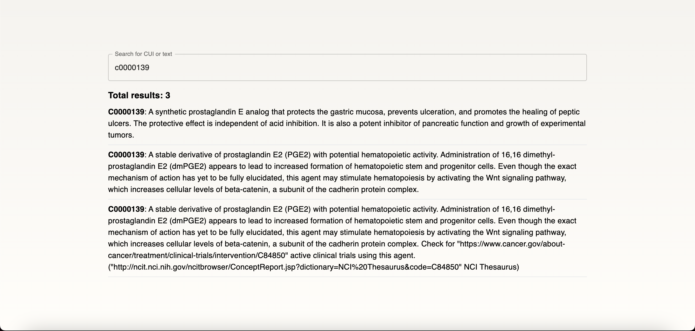

# Unified Medical Language System (UMLS) Mock

- [Unified Medical Language System (UMLS) Mock](#unified-medical-language-system-umls-mock)
  - [Demo](#demo)
  - [Features \& Usage](#features--usage)
  - [Getting Started in Localhost](#getting-started-in-localhost)
    - [Prequisites](#prequisites)
    - [Installation](#installation)
  - [Devlopment](#devlopment)
    - [Prerequisites](#prerequisites)
    - [1. 找到定義檔案以及其格式](#1-找到定義檔案以及其格式)
    - [2. 使用 Python 撰寫腳本將 .RRF 轉換成 .csv](#2-使用-python-撰寫腳本將-rrf-轉換成-csv)
    - [3. 將 .csv 匯入 Postgres](#3-將-csv-匯入-postgres)
    - [4. 後端 Entity, Repository, Service, Controller](#4-後端-entity-repository-service-controller)
    - [5. 前端介面](#5-前端介面)
    - [6. TODO: 應用 MetaMapLite 時添加模糊搜尋的功能](#6-todo-應用-metamaplite-時添加模糊搜尋的功能)
  - [MetaMapLite](#metamaplite)
    - [Download MetaMapLite](#download-metamaplite)
    - [MetaMapLite Documents](#metamaplite-documents)
  - [Deployment on Ubuntu](#deployment-on-ubuntu)

## Demo

**Demo 1: Search By Text**



**Demo 2: Search By CUI** (Case Insensitive: 不分大小寫)



## Features & Usage

可以將 [UMLS SAMPLES](./UMLS.postman_collection.json) 匯入 Postman 來測試 API。

**後端 API**

- [x] 透過 CUI 搜尋其定義

      測試: `http://localhost:8080/api/v1/umls/search/text?queryText=stroke`

- [x] 透過輸入文字搜尋其 CUIs 以及其定義

      測試: `http://localhost:8080/api/v1/umls/search/cui/C0000039`

目前已經佈署在 YHH Server 上了，要使用 API 只要把 `localhost:8080` 改成 Server IP 就可以了。

**前端**

- [x] 搜尋介面

**遭遇問題**

- [ ] 使 Search By Text 支援模糊搜尋(暫留優化階段再考慮)

MetaMapLite 不支援模糊搜尋(都較 Lite 要求快了當然不要模糊搜尋!)，因此輸入文字時要盡可能完整(模糊範圍是以一個單字內為距離)。然而一個 UMLS API 支援輸入文本字串進行模糊搜尋，對於查詢方便性來說應該是比較好的。

使用 MetaMapLite 搜尋: `renal tubular acidosis` 只會得到 CUI `C0001126`


但使用 UMLS 官網提供的 API 搜尋 `renal tubular acidosis` 會得到多個概念 CUIs


解決方法: 使用 MetaMapLite 前先對輸入文本進行預處理，以達到模糊搜尋的效果。模糊搜尋會降低效率，不適合於比對時使用，但對於查詢時是必要的。

## Getting Started in Localhost

> 一些連結待補充

### Prequisites

- (可跳過)下載 UMLS Dataset，因為已經轉換好放在伺服器資料庫上了。如果想導入在自己的資料庫檔案在 `./umls-data/MRDEF.csv`
- 安裝 MetaMapLite：用於將用戶輸入的詞彙映射到相應的 CUI。安裝方法與置放路徑請參考[Download MetaMapLite](#download-metamaplite)
- Java Spring Boot 3 with Java SDK 20+: 後端服務器框架，其他 Java 版本要修改 pom.xml
- 連接伺服器上的 PostgreSQL(稍後新增連線資訊在`.env`)
  - 另外可以搭配使用 Intellij 連接(Database -> '+' -> Data Source -> PostgreSQL -> 填入連線資訊)
- Node.js 14+

### Installation

1.  Clone the repo

    ```sh
    git clone https://github.com/CARRYUU/umls-search
    ```

    或使用 ssh

    ```sh
     git clone git@github.com:CARRYUU/umls-search.git
    ```

2.  前往後端資料夾安裝 Maven packages

    ```sh
    cd server
    mvn install
    ```

3.  修改後端環境變數

    `.env` 放置在 `server/src/main/resources` 資料夾下，

    ```sh
    cd server/src/main/resources
    cp .env.example .env # 複製範例檔案 .env.example 到 .env
    vi .env
    ```

    請修改以下環境變數

    ```sh
    POSTGRESQL_DATABASE=<放置DB連線URI>
    DB_USERNAME=<放置DB帳號>
    DB_PASSWORD=<放置DB密碼>
    ```

4.  運行後端伺服器

    ```sh
    cd ../..
    mvn spring-boot:run
    ```

    接下來要運行前端伺服器，打開新的 terminal

5.  前往前端資料夾安裝 NPM packages

    更新 npm

    ```sh
    npm install npm@latest -g
    ```

    到前端資料夾安裝 NPM 套件

    ```sh
    cd client
    npm install
    ```

6.  修改前端`.env.local`

    ```sh
    cp .env.local.example .env.local
    ```

    預設的後端伺服器網址是 `http://localhost:8080`，如果要修改請修改以下環境變數

    ```sh
    NEXT_PUBLIC_API_URL=<放置後端伺服器網址>
    ```

7.  運行前端伺服器 Next.js

    於開發模式運行

    ```sh
    npm run dev
    ```

    接下來就可以在瀏覽器開啟 `http://localhost:3000` 進行測試。

    如果要在生產模式運行，請先建置

    ```sh
    npm run build
    ```

    再運行

    ```sh
    npm run start
    ```

## Devlopment

### Prerequisites

為了實現這個 UMLS 搜索系統，需要以下工具和技術：

- UMLS Dataset
- MetaMapLite：用於將用戶輸入的詞彙映射到相應的 CUI。安裝方法可參考[Download MetaMapLite](#download-metamaplite)
- Java Spring Boot 3 with Java SDK 17+: 後端伺服器框架，建議使用 Java17 LTS 版本
- PostgreSQL: 用於存儲 UMLS 數據的數據庫。CUI, Definition
- Python 3.8+: 用於將 UMLS 數據轉換為 CSV 文件
- Node.js 14+: 用於構建前端界面

開始動工!

### 1. 找到定義檔案以及其格式

到官網[UMLS Knowledge Sources: File Downloads](https://www.nlm.nih.gov/research/umls/licensedcontent/umlsknowledgesources.html)下載 **UMLS Metathesaurus Level 0 Subset(NEW as of 2022AA)** 或其他版本。

> 目前 2022AA 比 2022AB 還完整

看一下表格定義 [Definitions (File = MRDEF.RRF)](https://www.ncbi.nlm.nih.gov/books/NBK9685/table/ch03.T.definitions_file_mrdef_rrf/?report=objectonly)

| Col.     | Description                                                                                                                                                               |
| -------- | ------------------------------------------------------------------------------------------------------------------------------------------------------------------------- |
| CUI      | Unique identifier for concept                                                                                                                                             |
| AUI      | Unique identifier for atom - variable length field, 8 or 9 characters                                                                                                     |
| ATUI     | Unique identifier for attribute                                                                                                                                           |
| SATUI    | Source asserted attribute identifier [optional-present if it exists]                                                                                                      |
| SAB      | Abbreviated source name (SAB) of the source of the definition。                                                                                                           |
| DEF      | Definition                                                                                                                                                                |
| SUPPRESS | Suppressible flag. Values = O, E, Y, or N. Reflects the suppressible status of the attribute; not yet in use. See also SUPPRESS in MRCONSO.RRF, MRREL.RRF, and MRSAT.RRF. |
| CVF      | Content View Flag. Bit field used to flag rows included in Content View. This field is a varchar field to maximize the number of bits available for use.                  |

看起來我們需要提取以下字段：

- `CUI`：概念的唯一標識符。
- `DEF`：定義。

### 2. 使用 Python 撰寫腳本將 .RRF 轉換成 .csv

因為對於 Postgres 來說 .csv 比較好匯入，所以寫個腳本轉個檔。

```python
import csv

def convert_rrf_to_csv(rrf_file, csv_file):
    with open(rrf_file, 'r', encoding='utf-8') as rrf, open(csv_file, 'w', encoding='utf-8', newline='') as csv_out:
        csv_writer = csv.writer(csv_out, delimiter=',', quotechar='"', quoting=csv.QUOTE_MINIMAL)

        for line in rrf:
            fields = line.strip().split('|')

            # 只選擇cui和definition欄位，即索引0和5
            selected_fields = [fields[0], fields[5]]
            csv_writer.writerow(selected_fields)

if __name__ == "__main__":
    rrf_file = '../MRDEF.RRF'  # 替換為RRF文件路徑
    csv_file = '../MRDEF.csv'  # 希望保存的CSV文件路徑
    convert_rrf_to_csv(rrf_file, csv_file)
```

### 3. 將 .csv 匯入 Postgres

導入時發現一個問題: 一個 CUI 可能會對應到多個 Definitions。如 CUI=C0000097 就有兩個 Definitions

因此需要添加一個自動遞增的 id 作為主鍵。

這邊使用 PgAdmin 中的 Query Tools 建立一個表格

```sql
CREATE TABLE umls_terms (
    id SERIAL PRIMARY KEY,
    cui VARCHAR(255) NOT NULL,
    definition TEXT NOT NULL
);
```

右鍵單擊 `umls_terms` 表，然後選擇**Import/Export**。在彈出的窗口中，選擇以下選項：

- 選擇**導入**。
- 文件名：選擇剛才生成的 CSV 文件。
- 格式：選擇 **csv**。
- 編碼：選擇“**UTF8**”。
- 分隔符：選擇逗號 `,`。
- 引用字符：選擇雙引號 `"`。
- 跳脫字元: 無。
- **Columns to import**: 選擇 `cui` 和 `definition`就好。
  選擇“開始”。

資料庫部分完成!

### 4. 後端 Entity, Repository, Service, Controller

裝好 MetaMapLite，在使用 Spring Initializer 建立一個 Spring Boot 專案。

在 Java Spring Boot 3 中，需要以下依賴項(Dependencies)：

- Spring Boot Starter Data JPA：用於簡化數據庫操作。
- Spring Boot Starter Web：用於構建 Web 服務。
- PostgreSQL JDBC Driver：用於連接到 PostgreSQL 數據庫。

### 5. 前端介面

- 前端框架：Next.js
- UI 組件庫：Material-UI 或 Ant Design
- HTTP 客戶端庫：Axios
- 錯誤追踪和監控：Sentry
- 防抖(Debounce)和節流：[use-debounce](https://www.npmjs.com/package/use-debounce)

處理問題

- 後端記得要設置 CORS
- .ENV: Next 專案的環境變數放置在`.env.local`中，並且要以`NEXT_PUBLIC_`開頭，才能在前端瀏覽器使用。

### 6. TODO: 應用 MetaMapLite 時添加模糊搜尋的功能

使用 [Apache Lucene 9](https://lucene.apache.org/)

- [Apache Lucene MVN Repository](https://mvnrepository.com/artifact/org.apache.lucene/lucene-core)
- [開源全文檢索、搜尋函式庫 Apache Lucene 9.0 效能大幅提升](https://www.ithome.com.tw/news/148360)

解析 MRCONSO.RRF?

## MetaMapLite

### Download MetaMapLite

1. Download [MetaMapLite](https://lhncbc.nlm.nih.gov/ii/tools/MetaMap/run-locally/MetaMapLite.html)
2. Create a folder named `metamaplite` in the backend root directory of this project.
3. Unzip the downloaded file and move the `public_mm_lite` folder into the `metamaplite` folder.
4. Put the UMLs Dataset folders into the `public_mm_mm_lite/data/ivf` folder.

It should look like this:

public_mm_lite 中只需要 `data` 底下的檔案，其他都不需要。所以也可以只下載資料集，重點是要將 MetaMapLite 安裝到本地的 Maven Repository 中。

```bash
.
└── umls-search/
    ├── client
    └── server/     # backend root directory
        ├── ...
        ├── metamaplite/
        │   └── public_mm_lite/
        │       └── data/       # UMLS Dataset folders
        │           ├── ivf/
        │           │   ├── 2022AA
        │           │   └── 2022AB
        │           └── ...
        ├── src/
        │   ├── main/
        │   │   ├── java
        │   │   └── resources/
        │   │       ├── metamaplite.properties      # MetaMapLite configuration file
        │   │       ├── .env # Environment variables
        │   │       └── ...
        │   └── test
        └── ...
```

Then, install metamaplite and dependencies into local Maven repository.

```bash
$ cd metamaplite/public_mm_lite

$ mvn install:install-file \
    -Dfile=lib/context-2012.jar \
    -DgroupId=context \
    -DartifactId=context \
    -Dversion=2012 \
    -Dpackaging=jar

$ mvn install:install-file \
    -Dfile=lib/bioc-1.0.1.jar \
    -DgroupId=bioc \
    -DartifactId=bioc \
    -Dversion=1.0.1 \
    -Dpackaging=jar

$ mvn install:install-file \
    -Dfile=lib/nlp-2.4.C.jar \
    -DgroupId=gov.nih.nlm.nls \
    -DartifactId=nlp \
    -Dversion=2.4.C \
    -Dpackaging=jar

$ mvn install:install-file  \
    -Dfile=lib/lvgdist-2020.0.jar \
    -DgroupId=gov.nih.nlm.nls.lvg \
    -DartifactId=lvgdist \
    -Dversion=2020.0 \
    -Dpackaging=jar
```

Then install metamaplite into your local Maven repository:

```bash
$ mvn install
```

補:

我在 macOS 上沒有問題，但使用 Windows 系統得先把 `~/public_mm_lite/src/test/java` 裡面的 `irutils/` 資料夾刪掉才能成功安裝。

### MetaMapLite Documents

- [MetaMapLite 3.6.2rc5 README Documentation](https://lhncbc.nlm.nih.gov/ii/tools/MetaMap/Docs/README_MetaMapLite_3.6.2rc5.html)
- [MetaMapLite Github Page](https://github.com/lhncbc/metamaplite)

## Deployment on Ubuntu

> 研究有夠久==，如果有人要用 Docker 可以補充一下

1.  首先先將本地專案建置成可執行的 jar 檔案，然後將 jar 檔案上傳到 Ubuntu 伺服器上。

    ```bash
    $ cd server
    $ mvn clean install
    ```

2.  接著到 Ubuntu 伺服器上安裝 Java 20。

    ```bash
    $ sudo apt update
    $ sudo apt install openjdk-20-jdk
    ```

    檢查 Java 版本

    ```bash
    $ java -version
    ```

    結果應該像下面這樣

    ```bash
    java version "20.0.1" 2023-04-18
    Java(TM) SE Runtime Environment (build 20.0.1+9-29)
    Java HotSpot(TM) 64-Bit Server VM (build 20.0.1+9-29, mixed mode, sharing)
    ```

3.  在 Ubuntu 伺服器上建立一個資料夾，並將 jar 檔案移動到該資料夾中。我是放在 `/home/ncuuser/deploy/uml-search-backend`

    ```bash
    $ mkdir umls-search
    ```

    上傳 jar 檔案到 Ubuntu 伺服器上的 `umls-search` 資料夾中，我是用 Mobaxterm，可以直接拖拉檔案到伺服器上。MacOS 的 Terminus 沒有拖拉介面可以用`scp`指令，或是用 FTP 軟體如 FileZilla。

4.  把 `metamaplite/public_mm_lite` (裡面有 data) 丟到與 jar 檔案同一個資料夾中。因為程式中有設定路徑，而且 MetaMapLite 不支援 classpath，所以必須把資料夾丟到同一個資料夾中。

    > 這邊我搞超久==想說為甚麼一直讀不到

5.  因為我們要讓這個程式變成一個 Service，所以我們要安裝 `systemd`。

    ```bash
    $ sudo apt install systemd
    ```

    並且建立一個 `umls-search.service` 檔案(檔名可以自己取)，並且放到 `/etc/systemd/system` 資料夾中。

    ```bash
    $ sudo vim /etc/systemd/system/umls-search.service
    ```

    添加內容如下(可以參考[這篇文章](https://www.baeldung.com/spring-boot-app-as-a-service)

    ```bash
    [Unit]
    Description=UMLS Search Service
    After=network.target

    [Service]
    User=ncuuser
    WorkingDirectory=/home/ncuuser/deploy/uml-search-backend
    ExecStart=/usr/bin/java -jar /home/ncuuser/deploy/uml-search-backend/umls-search-0.1.0.jar
    SuccessExitStatus=143
    Restart=always
    StandardOutput=syslog
    StandardError=syslog
    SyslogIdentifier=umls-search

    [Install]
    WantedBy=multi-user.target
    ```

    > `User` 要改成你的使用者名稱，`WorkingDirectory` 要改成你的 jar 檔案所在的資料夾，`ExecStart` 要改成你的 jar 檔案所在的路徑。

6.  重新載入 `systemd`，並且啟動 `umls-search.service`。

    ```bash
     $ sudo systemctl daemon-reload
     $ sudo systemctl enable umls-search.service
     $ sudo systemctl start umls-search.service
    ```

    檢查 `umls-search.service` 是否有正常運作

    ```bash
    $ sudo systemctl status umls-search.service
    ```

    內容應該會像下面這樣

    ```bash
    ● umls-search.service - UMLS Search Service
        Loaded: loaded (/etc/systemd/system/umls-search.service; enabled; vendor preset: enabled)
        Active: active (running) since Sat 2023-05-13 14:35:11 UTC; 6s ago
    Main PID: 349063 (java)
        Tasks: 56 (limit: 38109)
        Memory: 314.4M
        CPU: 11.207s
        CGroup: /system.slice/umls-search.service
                └─349063 /usr/bin/java -jar /home/ncuuser/deploy/uml-search-backend/umls-search-0.1.0.jar

    May 13 14:35:12 ubuntu-server umls-search[349063]: 2023-05-13T14:35:12.804Z  INFO 349063 --- [           main] org.hibernate.Version                    : HHH000412: Hibernate ORM core version 6.1.7.Final
    May 13 14:35:12 ubuntu-server umls-search[349063]: 2023-05-13T14:35:12.949Z  INFO 349063 --- [           main] com.zaxxer.hikari.HikariDataSource       : HikariPool-1 - Starting...
    May 13 14:35:13 ubuntu-server umls-search[349063]: 2023-05-13T14:35:13.073Z  INFO 349063 --- [           main] com.zaxxer.hikari.pool.HikariPool        : HikariPool-1 - Added connection org.postgresql.jdbc.PgConnection@60>
    May 13 14:35:13 ubuntu-server umls-search[349063]: 2023-05-13T14:35:13.074Z  INFO 349063 --- [           main] com.zaxxer.hikari.HikariDataSource       : HikariPool-1 - Start completed.
    May 13 14:35:13 ubuntu-server umls-search[349063]: 2023-05-13T14:35:13.088Z  INFO 349063 --- [           main] SQL dialect                              : HHH000400: Using dialect: org.hibernate.dialect.PostgreSQLDialect
    May 13 14:35:13 ubuntu-server umls-search[349063]: 2023-05-13T14:35:13.472Z  INFO 349063 --- [           main] o.h.e.t.j.p.i.JtaPlatformInitiator       : HHH000490: Using JtaPlatform implementation: [org.hibernate.engine.>
    May 13 14:35:13 ubuntu-server umls-search[349063]: 2023-05-13T14:35:13.476Z  INFO 349063 --- [           main] j.LocalContainerEntityManagerFactoryBean : Initialized JPA EntityManagerFactory for persistence unit 'default'
    May 13 14:35:13 ubuntu-server umls-search[349063]: 2023-05-13T14:35:13.710Z  WARN 349063 --- [           main] JpaBaseConfiguration$JpaWebConfiguration : spring.jpa.open-in-view is enabled by default. Therefore, database >
    May 13 14:35:13 ubuntu-server umls-search[349063]: 2023-05-13T14:35:13.893Z  INFO 349063 --- [           main] o.s.b.w.embedded.tomcat.TomcatWebServer  : Tomcat started on port(s): 8080 (http) with context path ''
    May 13 14:35:13 ubuntu-server umls-search[349063]: 2023-05-13T14:35:13.899Z  INFO 349063 --- [           main] com.sscs.Application                     : Started Application in 2.374 seconds (process running for 2.654)
    ```

7.  使用 curl 指令測試一下

    ```bash
    $ curl "http://localhost:8080/api/v1/umls/search/text/renal%20tubular%20acidosis"
     {"totalCount":4,"results":[{"id":105507,"cui":"C0001126","definition":"A group of genetic disorders of the KIDNEY TUBULES characterized by the accumulation of metabolically produced acids with elevated plasma chloride, hyperchloremic metabolic ACIDOSIS. Defective renal acidification of URINE (proximal tubules) or low renal acid excretion (distal tubules) can lead to complications such as HYPOKALEMIA, hypercalcinuria with NEPHROLITHIASIS and NEPHROCALCINOSIS, and RICKETS."},{"id":105508,"cui":"C0001126","definition":"rare sometimes familial disorder of the renal tubule characterized by the inability to excrete urine of normal acidity; this leads to a hyperchloremic acidosis which is often associated with one or more secondary complications such as hypercalcinuria with nephrolithiasis and nephrocalcinosis, rickets, or osteomalacia and severe potassium depletion."},{"id":105509,"cui":"C0001126","definition":"Acidosis owing to malfunction of the kidney tubules with accumulation of metabolic acids and hyperchloremia, potentially leading to complications including hypokalemia, hypercalcinuria, nephrolithiasis and nephrocalcinosis. [HPO:probinson]"},{"id":105510,"cui":"C0001126","definition":"The inability of the kidneys to maintain acid-base homeostasis."}]}
    ```

    看起來沒問題，那就要測試從別台電腦是否可以正常存取了。

8.  於 Ubuntu Server 上打開 8080 port

    ```bash
    $ sudo ufw allow 8080
    ```

9.  於別台電腦上使用 Postman 測試

    GET `http://140.115.80.103:8080/api/v1/umls/search/text/renal tubular acidosis`

    得到以下結果

    ```json
    {
      "totalCount": 4,
      "results": [
        {
          "id": 105507,
          "cui": "C0001126",
          "definition": "A group of genetic disorders of the KIDNEY TUBULES characterized by the accumulation of metabolically produced acids with elevated plasma chloride, hyperchloremic metabolic ACIDOSIS. Defective renal acidification of URINE (proximal tubules) or low renal acid excretion (distal tubules) can lead to complications such as HYPOKALEMIA, hypercalcinuria with NEPHROLITHIASIS and NEPHROCALCINOSIS, and RICKETS."
        },
        {
          "id": 105508,
          "cui": "C0001126",
          "definition": "rare sometimes familial disorder of the renal tubule characterized by the inability to excrete urine of normal acidity; this leads to a hyperchloremic acidosis which is often associated with one or more secondary complications such as hypercalcinuria with nephrolithiasis and nephrocalcinosis, rickets, or osteomalacia and severe potassium depletion."
        },
        {
          "id": 105509,
          "cui": "C0001126",
          "definition": "Acidosis owing to malfunction of the kidney tubules with accumulation of metabolic acids and hyperchloremia, potentially leading to complications including hypokalemia, hypercalcinuria, nephrolithiasis and nephrocalcinosis. [HPO:probinson]"
        },
        {
          "id": 105510,
          "cui": "C0001126",
          "definition": "The inability of the kidneys to maintain acid-base homeostasis."
        }
      ]
    }
    ```

    完畢

    前端加油！
